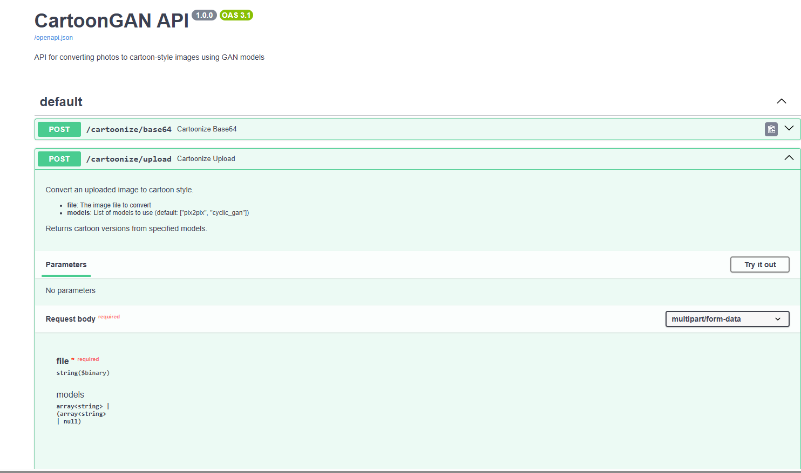
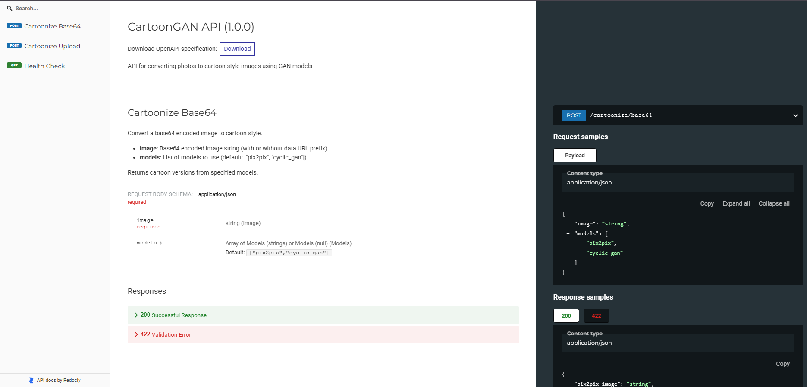

# Generating Cartoon Images API
This section describes how the backend is structured and how to use the models (pix2pix and cyclic_gan) for inference as well as the Inferencing API built using FastAPI.  

# Scripts description 
**generate_Images.py** This script contains the actual inference logic. it accepts it contains the functions that takes the input image and generate the corresponding cartoon image. 

**Custom_layers.py** This script contain the custom layer `instanceNormalization` used in cyclic_gan

**preprocess_image.py** This script is the first script in the pipeline. it returns the input image as a tensor with a batch dimension. the returned tensor is passed to the generator models in generate_images.py

**image_utils.py** Contains various image conversion functions. for frontend rendering or to be used in the api response body.

**test.py and server.py** test.py is used to test the entire pipeline whilst server.py is used to start the api.

**main.py** Main.py contains the api logic. it contains the functions and methods for preprocessing and returning the cartoon generated image. All the scripts above are brought together in main.py

# API in action
Obviously, fastapi provides automatic documentation as seen below. 
after installing the requirements with `pip install -r requirements.txt` start the server with `python server.py`
navigate to `localhost:8000/docs`
You can try the api here by passing in an image and seeing the response body

A more detailed documentation can also be seen at `localhost:8000/redoc`

# Quickstart
1. Install requirements: `pip install -r requirements.txt`
2. Start the server: `python server.py`
3. Open your browser and go to `localhost:8000/docs` or `localhost:8000/redoc`
4. Try the API by uploading an image and viewing the cartoonized result in the response body.

---
If you have any issues, check your environment, image paths, and model files. This backend is designed to be modular and easy to extend. Enjoy cartoonizing your images!

